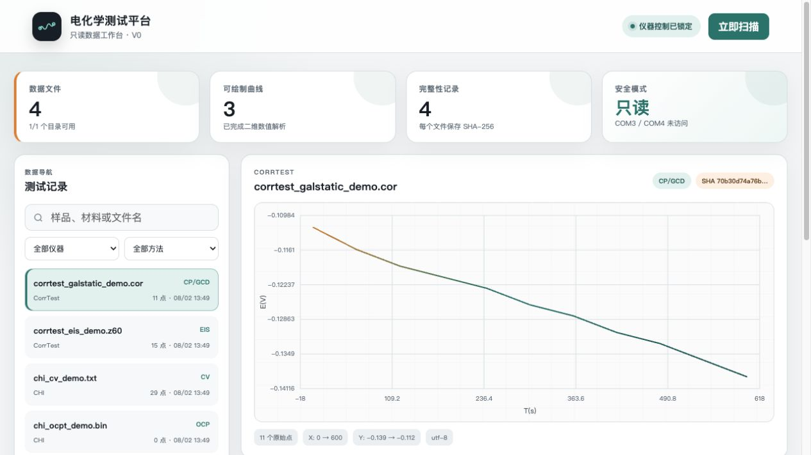

# 电化学测试平台 V0

[](LICENSE)
[](https://github.com/xinxinzai98/echem-platform/releases)

[中文](README.md) | [English](README.en.md)

> Echem Platform is a local-first, read-only workbench for indexing and visualizing CHI and CorrTest electrochemistry exports. It fingerprints every source with SHA-256 and keeps experimental files unchanged.

当前稳定版本：`0.1.4`

这是一个刚公开、处于早期阶段的本地电化学数据工作台。它面向数据索引、二维曲线预览和可追溯元数据，不连接串口、不启动仪器软件，也不修改原始测试文件。目前尚无经确认的独立外部采用者。



## V0 能做什么

- 监听指定数据目录并建立文件索引
- 识别常见 CHI 文本导出和 CorrTest `.cor` / `.z60` 文本数据
- 对 CHI `.bin` 文件只登记元数据和 SHA-256，不尝试逆向解析或修改
- 展示 CV、LSV、EIS、OCP、CA/CP 等二维曲线
- 在平台自己的 SQLite 数据库中保存样品编号、材料、电解液、面积、标签和备注
- 记录导入、更新和人工编辑审计日志
- 默认只监听 `127.0.0.1`，仅供本机浏览器访问

## 安全边界

- 不打开 COM3、COM4 或其他串口
- 不执行 CHI 宏，不调用 CorrTest SDK
- 不启动、停止或控制仪器软件
- 不向监控目录写入、重命名或删除文件
- 文件仍在写入时暂缓导入
- 每个源文件以完整 SHA-256 指纹标识
- 不上传云端，不调用外部网络服务

完整边界和漏洞报告方式见 [SECURITY.md](SECURITY.md)，已知限制见 [KNOWN_LIMITATIONS.md](KNOWN_LIMITATIONS.md)。

## 三分钟合成数据演示

需要 Python 3.9 或更高版本，不需要安装第三方包：

```sh
python3 scripts/run_demo.py
```

预期结果是发现并索引 4 个合成文件，其中 3 个可绘制、1 个仅登记元数据、0 个读取错误。完整步骤、预期字段和截图见 [docs/quickstart-demo.md](docs/quickstart-demo.md)。示例来源和校验值见 [demo_data/README.md](demo_data/README.md)。

## 本地运行

```sh
python3 app.py
```

浏览器打开 `http://127.0.0.1:8787`。

只扫描一次并退出：

```sh
python3 app.py --scan-once
```

Windows 源码用户可使用 `py -3 app.py`。仓库中的 `start-windows.cmd` 只适用于维护者构建且包含 `runtime/python.exe` 的便携包；源码归档本身不捆绑 Python 运行时。

## 配置实际数据目录

编辑 `config.json` 中的 `watch_roots`。绝对路径可以直接使用；相对路径以配置文件所在目录为基准。

```json
{
  "watch_roots": [
    "D:\\电化学数据\\CorrTest",
    "D:\\电化学数据\\CHI"
  ]
}
```

提交任何数据样例前必须阅读 [DATA_POLICY.md](DATA_POLICY.md)。真实实验数据、厂商安装包、SDK、帮助文件、私有配置和日志不得进入公开仓库。

## 测试与发布检查

```sh
python3 -m unittest discover -s tests -v
python3 scripts/run_demo.py
python3 scripts/check_public_tree.py
python3 scripts/check_docs.py
node --check static/app.js
```

本项目当前不使用托管 CI。发布证据来自在干净提交上运行上述可复现命令，并从解压后的发布包再次执行相同检查；这不构成跨操作系统 CI 覆盖声明。验证记录见 [VALIDATION.md](VALIDATION.md)，发布流程见 [docs/RELEASING.md](docs/RELEASING.md)。

## 项目状态与参与方式

- 真实使用与采用口径：[ADOPTION.md](ADOPTION.md)
- 贡献指南：[CONTRIBUTING.md](CONTRIBUTING.md)
- 版本记录：[CHANGELOG.md](CHANGELOG.md)
- 路线图：[ROADMAP.md](ROADMAP.md)
- 维护者：[MAINTAINERS.md](MAINTAINERS.md)
- 引用信息：[CITATION.cff](CITATION.cff)
- 第三方依赖：[THIRD_PARTY_NOTICES.md](THIRD_PARTY_NOTICES.md)

## 许可证

代码以 [MIT License](LICENSE) 发布。示例数据的适用范围见 [DATA_POLICY.md](DATA_POLICY.md)。
